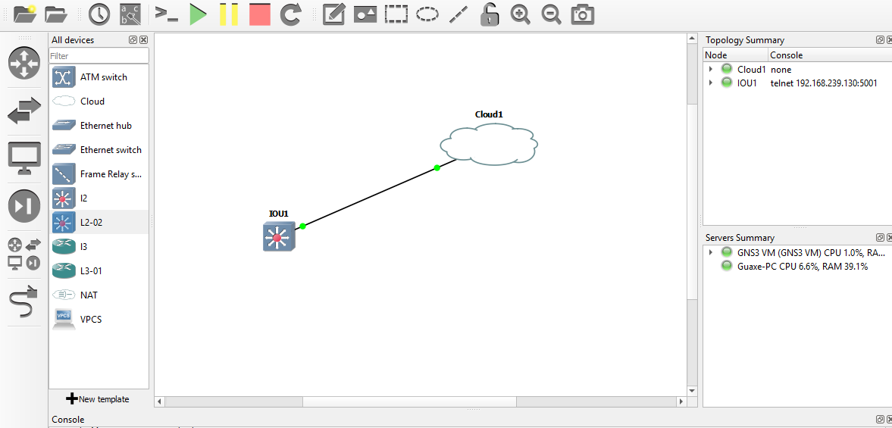

# Netmiko automação de rede

Documentação netmiko oficial https://github.com/ktbyers/netmiko

Projeto de estudo para automação de redes, com proposito de mitigar trabalho repetitivo.
Netmiko utiliza conexões ssh para executar scripts de configuração nos ativos de rede. 
Inicialmente é utilizado Dockerfile com makefile para automatizar a construção da imagem e e o 
provisionamento do container com python e o netmiko instalados.

image-readme/
│
├── scripts/ 
│ ├── primeiroScript.py 
│ └── show_interface_summary.py 
│ ├── app.py 
├── Dockerfile 
├── Makefile 
├── requirements.txt 
└── README.md

#### Topologia simples do projeto no simulador GNS3 rodando no VMWare 

